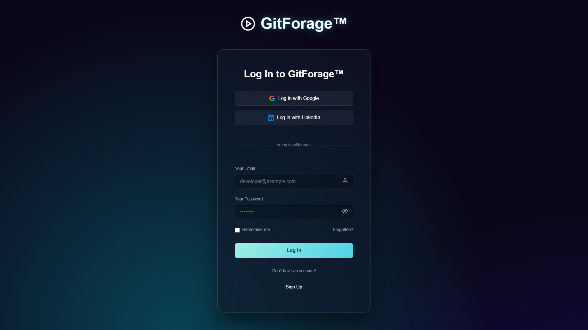
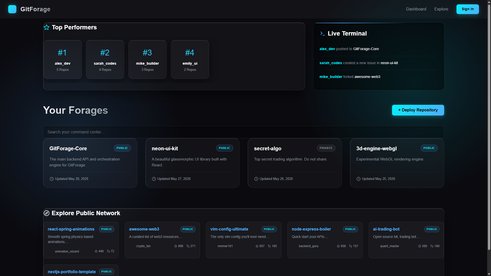
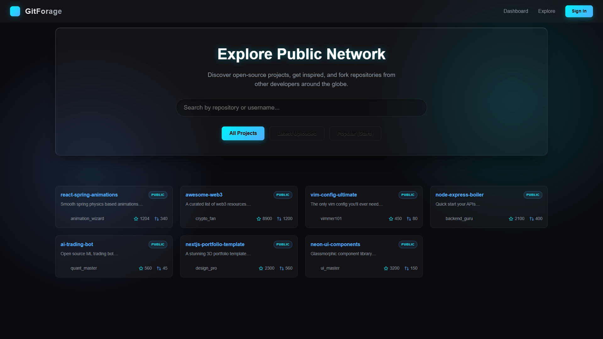
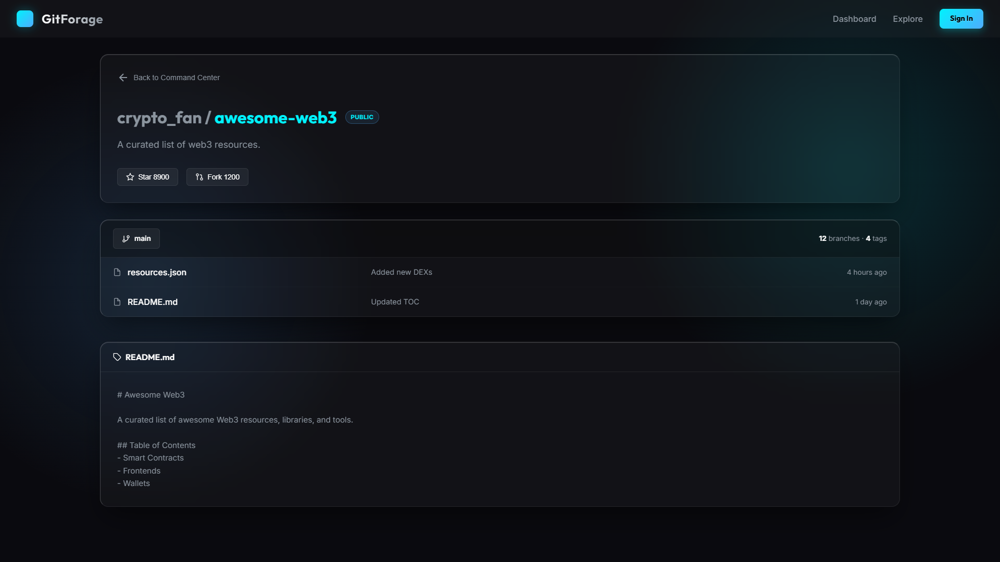
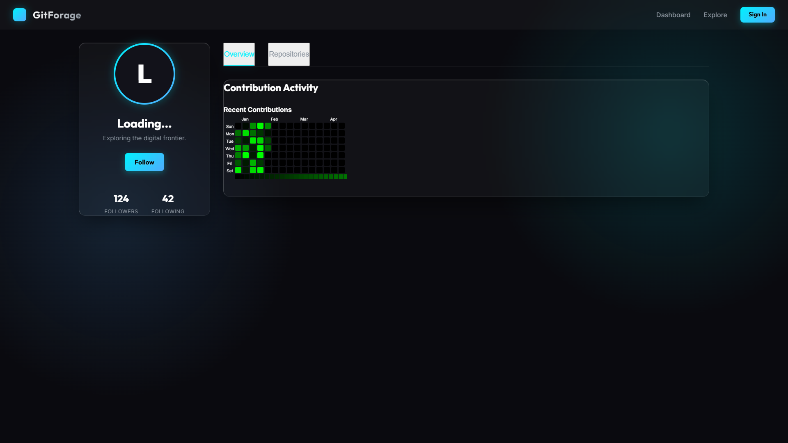

# GitForage™ - The Modern Developer Hub 🚀

GitForage is a premium, interactive 3D platform designed to serve as a modern Command Center for developers. It combines the utility of a code repository platform with the visual aesthetics of a futuristic, dark-mode terminal.

## 🌟 Key Features

### 1. Unified 3D Aesthetics
- **Dark Neon Theme**: A stunning `#0b071a` background featuring animated glowing cyan (`#00f2fe`) and purple (`#9d64ff`) orbs.
- **Glassmorphism**: Floating semi-transparent `.glass-panel` components with heavy background blur, dynamic drop-shadows, and specular highlights.
- **3D Physics**: Interactive repository cards and auth panels that physically tilt (`rotateX`, `rotateY`) based on hover interactions using CSS 3D transforms.

### 2. Immersive "Command Center" Dashboard
- **Your Forages**: Manage all your personal repositories in a beautiful 3D grid layout.
- **Top Performers Pedestals**: Showcase top platform users on floating 3D pedestals.
- **Live Terminal Overlay**: An animated activity stream that simulates live network events (commits, forks, issues) with scanning laser effects.

### 3. Dynamic Repository Management
- **Deploy Repository**: Fully functional 3D modal to instantly deploy new repositories. State is persisted locally via `localStorage` for seamless sessions.
- **3D File Viewer**: A dedicated `/repo/:id` viewer space displaying dynamic mock data, custom READMEs, and advanced file hierarchy.
- **Instant Forking**: Easily "take" (fork) a repository from the Explore network directly into your personal Command Center.

### 4. Global Explore Network
- **Dedicated Hub (`/public`)**: Access open-source projects from developers worldwide.
- **Advanced Filtering**: Instantly sort the global network by "Latest Uploaded" or "Popular (Stars)".
- **Real-time Search**: Glassmorphic search bar to filter repositories by name or owner in real-time.
- **Rich Analytics**: Cards feature dynamic avatar generation (Dicebear API) and precise statistics (Stars, Forks).

### 5. Seamless Authentication Flow
- Centered 3D floating auth forms over the animated neon mesh background.
- Simulated OAuth integrations with Google and LinkedIn.
- Built-in "UI Bypass Mode" allowing testing of the Dashboard even if the backend MongoDB instance is unavailable.

## 💻 Tech Stack
- **Frontend**: React.js, React Router DOM, Vite
- **Styling**: Vanilla CSS with advanced `@keyframes` and 3D perspectives (Zero external CSS frameworks for maximum creativity)
- **Backend (Optional/Extendable)**: Node.js, Express, MongoDB
- **Data Persistence**: LocalStorage (for UI mock session persistence)

## 🚀 How to Run Locally

1. **Clone the repository:**
   ```bash
   git clone https://github.com/ayush200545/GitHub-Platform.git
   cd GitHub-Platform
   ```

2. **Start the Frontend:**
   ```bash
   cd frontend-main
   npm install
   npm run dev
   ```
   Open `http://localhost:5173` in your browser.

3. **Start the Backend (Optional):**
   ```bash
   cd backend-main
   npm install
   npm run start
   ```

## 📸 Platform Showcase

### 1. The 3D Dark Neon Auth Experience

*A truly unique login experience featuring floating glassmorphic panels, CSS 3D transforms (`rotateX/Y`), and an animated glowing neon mesh background.*

### 2. The Command Center Dashboard

*Manage your deployed repositories, view Top Performers on 3D pedestals, and watch simulated real-time developer activity on the Live Terminal overlay.*

### 3. The Global Explore Network

*Access the global network. Use the glassmorphic search bar or dynamic filters to instantly sort by "Latest Uploaded" or "Popular".*

### 4. Repository 3D Viewer

*Dive into any public repository. View file structures, dynamic mock data, custom READMEs, and instantly Fork projects to your own dashboard!*

### 5. Developer Profile

*A persistent, sticky left-hand sidebar containing user stats, with custom tabbed navigation to view the GitHub-style Contribution Heatmap and owned repositories.*

---
*Built as a showcase for advanced modern web design and interactive component engineering.*
